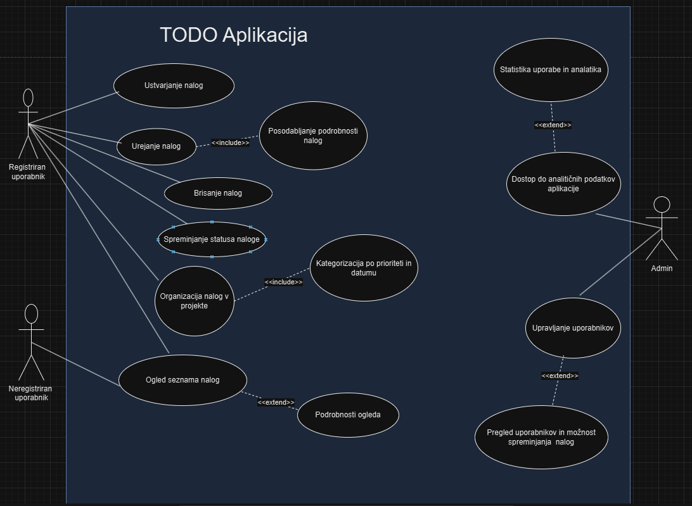

# TODO Aplikacija

Dobrodošli v projektu TODO aplikacije! Ta aplikacija omogoča uporabnikom upravljanje svojih nalog preko sodobnega in preprostega vmesnika. Aplikacija je razdeljena na dva dela:
- **Backend** (Spring Boot): zagotavlja REST API za upravljanje nalog
- **Frontend** (React): uporabniški vmesnik za interakcijo z aplikacijo

## Skupina
- **Filip Knez**
- **Gal Kovše**
- **Gaj Korosec**

## Dokumentacija za razvijalce

### Struktura projekta
Projekt je razdeljen na dva glavna direktorija:
- **/backend**: vsebuje kodo za Spring Boot API.
- **/frontend**: vsebuje kodo za React aplikacijo.

**Backend** uporablja strukturo tipično za Spring Boot projekte:
- **src/main/java**: vsebuje Java razrede (kontrolerji, storitve, repozitoriji).
- **src/main/resources**: vsebuje konfiguracijske datoteke (application.properties itd.).

**Frontend** uporablja strukturo tipično za React projekte:
- **src**: vsebuje vse React komponente in logiko aplikacije.
- **public**: statični viri, kot so HTML datoteka, favicon in druge statične slike.

### Standardi kodiranja
- **Java**: sledimo Java Code Conventions, ki vključuje CamelCase za imena razredov in metod, ter PascalCase za spremenljivke. Razredne oznake (annotations) so vedno na začetku razreda ali metode.
- **JavaScript/React**: sledimo standardom ECMAScript 6 (ES6), uporabljamo funkcijske komponente in modularno kodo. Komponente so v PascalCase, funkcije in spremenljivke v camelCase.

## Navodila za nameščanje

1. **Preverite zahteve**:
    - Nameščen **Java** (JDK 17 ali novejši)
    - Nameščen **Node.js** (različica 14 ali novejša)
    - Nameščen **npm** (priložen Node.js)
    - Priporoča se tudi nameščena **Git** za različice in prispevanje k projektu.

2. **Klonirajte repozitorij**:
   ```bash
   git clone https://github.com/vaše-uporabniško-ime/todo-aplikacija.git
   cd todo-aplikacija
3. **Namestite backend**:
    - Pojdite v mapo backend:
      ````bash
      cd backend
    - Namestite vse odvisnosti in zaženite aplikacijo:
      ````bash
      ./mvnw spring-boot:run
4. **Namestite frontend**:
    - Odprite novo terminalsko okno in se pomaknite v mapo frontend:
      ````bash
      cd ../frontend
    - Namestite npm odvisnosti in zaženite React aplikacijo:
      ````bash
      npm install
      npm start
    - Frontend bo na voljo na http://localhost:3000 in bo komuniciral z backendom na http://localhost:8080.

## Navodila za razvijalce

### Prispevanje k projektu
- **Fork** projekta in naredite pull request s spremembami.
- Nove funkcionalnosti ali popravke pred pošiljanjem testirajte.

### Orodja in različice
- **Backend**:
    - Framework: Spring Boot (različica 2.5.4 ali novejša)
    - Build orodje: Maven
- **Frontend**:
    - Framework: React (različica 17 ali novejša)
    - Package manager: npm

## Vizija projekta

TODO aplikacija je zasnovana za uporabnike, ki želijo enostavno in učinkovito upravljati svoje naloge in opravila. Namen aplikacije je izboljšati produktivnost uporabnikov, saj jim omogoča pregled nad nalogami, lažjo organizacijo in sledenje napredku. Cilj je ponuditi uporabniku prijazno rešitev za organizacijo vsakodnevnih opravil, ki je dostopna kjerkoli in kadarkoli. Aplikacija je primerna za posameznike, ekipe ali podjetja, ki potrebujejo boljšo organizacijo delovnih procesov in želijo optimizirati svojo učinkovitost.

## Besednjak

- **Naloga**: Posamezno opravilo ali aktivnost, ki jo je potrebno izvesti.
- **Projekt**: Skupina nalog, ki spadajo pod določeno temo ali cilj.
- **Uporabniški račun**: Profil uporabnika, ki mu omogoča dostop do aplikacije in varno shranjevanje njegovih podatkov.
- **Seznam opravil**: Struktura, ki združuje naloge po določenih kriterijih, na primer "Opraviti danes" ali "Opravila za naslednji teden".
- **Status naloge**: Stanje naloge, ki označuje, ali je ta odprta, v teku ali zaključena.

## Diagram primerov uporabe

Spodaj je prikazan diagram primerov uporabe za TODO aplikacijo, ki ponazarja glavne interakcije med uporabnikom in aplikacijo. Diagram vključuje naslednje funkcionalnosti:
- Ustvarjanje, urejanje in brisanje nalog.
- Organizacija nalog v projekte.
- Spreminjanje statusa naloge.
- Prijava in odjava iz uporabniškega računa.



**Opis primerov uporabe**:
1. **Ustvarjanje nalog**: Uporabnik lahko dodaja nove naloge in jim dodeljuje projekte, roke in prioritete.
2. **Urejanje nalog**: Omogoča uporabniku spreminjanje že obstoječih nalog, na primer spreminjanje roka ali statusa.
3. **Brisanje nalog**: Uporabnik lahko odstrani naloge, ki niso več potrebne.
4. **Prijava in odjava**: Omogoča uporabnikom prijavo v sistem za dostop do lastnih nalog in podatkov.
5. **Nastavljanje opomnika za nalogo**: Registrirani uporabniki lahko nastavijo opomnike za posamezne naloge, da jih aplikacija obvesti pred datumom roka ali ob drugih pomembnih trenutkih:
     - Povezave:
         - Razširi **Urejanje naloge**: Omogoča uporabnikom, da dodajo ali spremenijo opomnik med urejanjem naloge.
         - Vključuje **Izbira načina obvestila**: Uporabnik lahko izbere način obvestila (npr. e-mail, potisno obvestilo, SMS).
         - Vključuje **Pošiljanje obvestila**: Aplikacija pošlje obvestilo uporabniku glede na nastavljeni opomnik ali ob specifičnih dogodkih (npr. sprememba statusa naloge ali bližanje roka).
6. **Upravljanje obvestil**: Uporabnik lahko upravlja vsa svoja obvestila, jih pogleda, odstrani ali začasno onemogoči:
    - Povezave: 
        - Vključuje **Pregled aktivnih opomnikov**: Prikazuje seznam vseh aktivnih opomnikov za naloge.
        - Razširi **Onemogočanje obvestil**: Omogoča uporabniku, da začasno ustavi vsa obvestila za naloge ali za določene naloge.

**Podrobni opisi primerov uporabe po podanem obrazcu se nahajajo v :**:

[Podobni opisi primerov uporabe ](PodrobenOpisPrimerovUporabe.docx)


